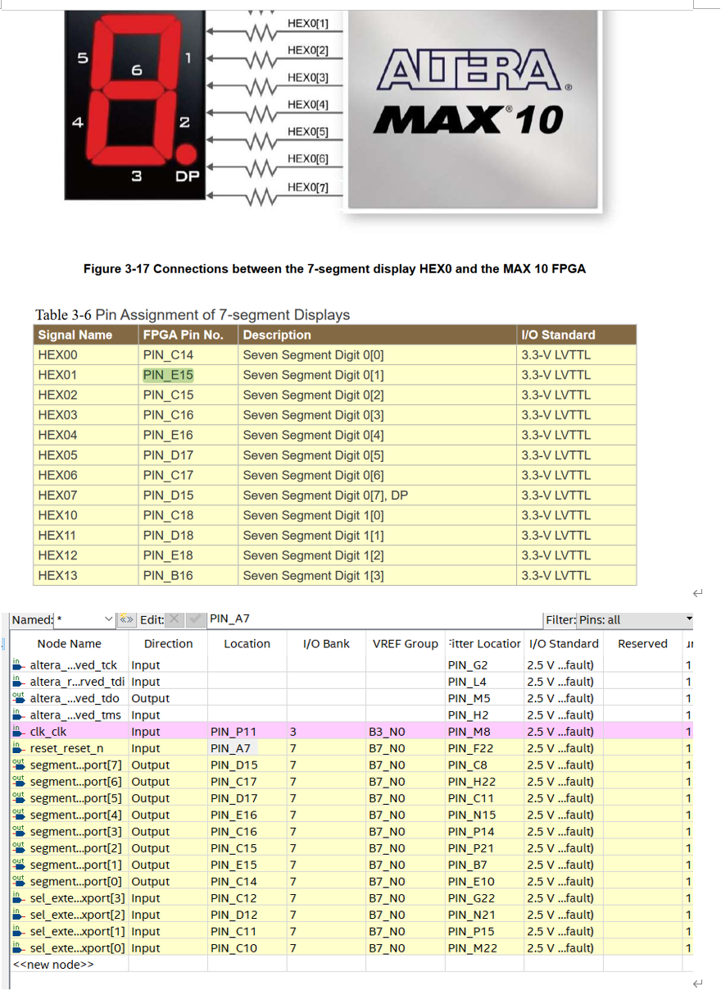

# Lab2 : « Let’s count ! »

1. Implémenter un compteur décimal sur 1 chiffre et l’afficher sur un afficheur 7 segments.

   a. Écrire le programme logiciel (software) du compteur

   - **Idée principale :**
     - Dans la fonction principale `main()`, on utilise une variable `count` pour représenter la valeur actuelle à afficher (intervalle 0 à 9).
     - À chaque itération de la boucle, on incrémente `count` de 1 ; s’il dépasse 9, on revient à 0. Puis on envoie cette valeur au matériel (écriture dans un PIO ou un registre Avalon-MM personnalisé), qui se charge de l’affichage.
     - On insère un court délai (par exemple `usleep(500000)`) de manière à ce que la fréquence de changement soit visible à l’œil nu.

   ```c
   #include <io.h>
   #include "system.h"      // Contient PIO_BASE / adresses QSYS
   #include <unistd.h>      // usleep
   #include "sys/alt_stdio.h"
   
   int main(void) {
       unsigned int count = 0;
   
       while(1) {
           // 1) Écrire count dans le matériel (par exemple un PIO 4 bits)
           //   IOWR_32DIRECT(SEL_BASE, 0, count & 0xF);
   
           // 2) Incrémenter la valeur, revenir à 0 si on dépasse 9
           count = (count + 1) % 10;
   
           // 3) Affichage de debug éventuel
           alt_printf("Current count=%x\n", count);
   
           // 4) Délai (0,5 seconde)
           usleep(500000);
       }
       return 0;
   }
   ```

   - Dans la pratique, on doit d’abord s’assurer qu’il y a un PIO de 4 bits dans **QSYS** (direction = Output) et que l’adresse de base est définie dans `system.h` comme `SEL_BASE`. À chaque fois que le logiciel écrit `(count & 0xF)` dans le PIO, cela signifie « envoyer la valeur 0~9 au matériel ».
   - Il est également possible d’utiliser un autre moyen (par exemple un IP Avalon-MM personnalisé) pour lire/écrire la valeur.

   b. Écrire un composant `seven_seg_handler.vhd`
    (ci-dessous nommé `deco7seg.vhd`)

   **Fonctionnalité :**

   - Il reçoit en entrée un bus de 4 bits (`digit_in`) qui représente une valeur décimale 0~9, et produit en sortie (`seg_out`) les 7 (ou 8) signaux à envoyer à l’afficheur 7 segments pour allumer correctement le chiffre.
   - Pour un afficheur **à anode commune** : la sortie “1” signifie éteint, “0” signifie allumé ; pour un **afficheur à cathode commune**, c’est l’inverse.

   ```vhdl
   library ieee;
   use ieee.std_logic_1164.all;
   use ieee.numeric_std.all;
   
   entity deco7seg is
       port (
           clk     : in  std_logic;
           reset   : in  std_logic;
           sel     : in  std_logic_vector(3 downto 0);  
           segment : out std_logic_vector(7 downto 0)   
       );
   end entity deco7seg;
   
   architecture description of deco7seg is
   begin
   
       process(clk, reset)
       begin
           if reset = '0' then
               segment <= (others => '1');  -- Éteindre tous les segments
           elsif rising_edge(clk) then
               case sel is
                   when "0000" =>
                       segment <= "11000000";  -- 0
   						  
                   when "0001" =>
                       segment <= "11111001";  -- 1
   						  
                   when "0010" =>
                       segment <= "10100100";  -- 2
   
                   when "0011" =>
                       segment <= "10110000";  -- 3
   
                   when "0100" =>
                       segment <= "10011001";  -- 4
   
                   when "0101" =>
                       segment <= "10010010";  -- 5
   
                   when "0110" =>
                       segment <= "10000010";  -- 6
   
                   when "0111" =>
                       segment <= "11111000";  -- 7
   
                   when "1000" =>
                       segment <= "10000000";  -- 8
   
                   when "1001" =>
                       segment <= "10010000";  -- 9
   
                   when others =>
                       segment <= "11111111";  -- Éteint (incluant le point)
               end case;
           end if;
       end process;
   
   end architecture;
   ```

   Dans cet exemple, le codage est fait pour un **afficheur à anode commune** (1=éteint, 0=allumé) et l’ordre des bits est `gfedcba`.

   ------

   ### (c) `top_lab2.vhd`

   **Rôle :**

   - C’est le fichier de plus haut niveau, qui :
     1. **Instancie `lab2`** (le système Qsys généré, contenant un PIO 4 bits : `sel_external_connection_export`)
     2. **Instancie `deco7seg`** (la logique de décodage 7 segments ; on peut l’appeler `seven_seg_handler`)
     3. Relie la sortie 4 bits du PIO (écrite par le logiciel) à l’entrée `sel` du décodeur ; et connecte la sortie `segment` au signal externe `seg_out`.

   ```vhdl
   library ieee;
   use ieee.std_logic_1164.all;
   use ieee.numeric_std.all;
   
   entity top_lab2 is
       port (
           clk       : in  std_logic;
           reset_n   : in  std_logic;
           seg_out   : out std_logic_vector(7 downto 0)
       );
   end entity top_lab2;
   
   architecture rtl of top_lab2 is
   
       component lab2 is
           port (
               clk_clk                            : in  std_logic;
               reset_reset_n                      : in  std_logic;
               segment_external_connection_export : out std_logic_vector(7 downto 0);
               sel_external_connection_export     : out std_logic_vector(3 downto 0)
           );
       end component;
   
       component deco7seg is
           port (
               clk     : in  std_logic;
               reset   : in  std_logic;
               sel     : in  std_logic_vector(3 downto 0);
               segment : out std_logic_vector(7 downto 0)
           );
       end component;
   
       signal sel_from_qsys : std_logic_vector(3 downto 0);
   
   begin
   
       -- Instancier le système Qsys : lab2
       u0 : lab2
           port map (
               clk_clk        => clk,
               reset_reset_n  => reset_n,
               -- On laisse la sortie 8 bits de PIO non connectée
               segment_external_connection_export => open,
               -- On relie la sortie du PIO 4 bits à sel_from_qsys
               sel_external_connection_export     => sel_from_qsys
           );
   
       -- Instancier le décodeur 7 segments
       u1 : deco7seg
           port map (
               clk     => clk,
               reset   => reset_n,
               sel     => sel_from_qsys,
               segment => seg_out
           );
   
   end architecture rtl;
   ```

   ### (d) Attribution des broches (Pin Assignment)

   

   ### (e) Dans Qsys

   1. **Créer / Ouvrir** `lab2.qsys`
   2. **Ajouter** un PIO de 4 bits nommé “sel”, direction = Output (côté CPU), largeur = 4
   3. Ici, on peut aussi ajouter un PIO de 8 bits “segment” (dans l’exemple, il n’est pas forcément utilisé)
   4. Connecter `clk_0`, `reset_0` ; attribuer l’adresse de base
   5. Exporter
      - `sel_external_connection` => 4 bits sortant
      - `segment_external_connection` => 8 bits sortant (optionnel)
   6. Générer Qsys => cela produit `lab2.v`, `lab2.qip`, `system.h`, etc. 
   7. Dans **Quartus**, ajouter `lab2.qip` au projet et compiler avec `top_lab2.vhd`.

   ------

   ### (e) Dans Nios II (logiciel)

   1. **Écrire `main.c`** (voir la section (a) ci-dessus).

   2. Vérifier que le projet inclut bien `system.h`, qui contient `#define SEL_BASE ...`.

   3. Utiliser `IOWR_32DIRECT(SEL_BASE, 0, (count & 0xF))` pour écrire la valeur 4 bits.

   4. Générer la BSP : `nios2-bsp hal bsp lab2.sopcinfo`

   5. Générer le Makefile :

      ```bash
      nios2-app-generate-makefile \
         --app-dir . \
         --bsp-dir bsp \
         --elf-name my_app.elf \
         --src-files main.c
      ```

   6. Compiler : `make`, puis charger dans le CPU : `nios2-download -g my_app.elf`.

   <video src="./assets/ec7a3d7f79b56c2265469cecf36bd887.mp4" controls width="640">
     Your browser does not support HTML5 video.
   </video>

   ------

2. Rendre le design compatible avec QSYS…

   a. Écrire une interface Avalon pour votre design

   1. Première étape : Dans votre fichier `.vhd`, écrire une interface Avalon-MM

      En VHDL, pour qu’un module (component) puisse être identifié comme **esclave (slave) Avalon-MM** par Qsys, on déclare en général :

      - `clk` : horloge
      - `reset_n` : reset actif bas
      - Côté Avalon-MM slave :
        - `avs_address    : in  std_logic_vector(...)`
        - `avs_write      : in  std_logic`
        - `avs_read       : in  std_logic`
        - `avs_writedata  : in  std_logic_vector(31 downto 0)`
        - `avs_readdata   : out std_logic_vector(31 downto 0)`
        - `avs_waitrequest`, `avs_chipselect` (le plus souvent nécessaire)

      Exemple ci-dessous : `deco7seg_avalon.vhd`, pour un module qui implémente un registre 32 bits en lecture/écriture via Avalon-MM, et qui décode 4 bits sur un afficheur 7 segments :

      ------

      ## `deco7seg_avalon.vhd`

      ```vhdl
      library ieee;
      use ieee.std_logic_1164.all;
      use ieee.numeric_std.all;
      
      entity deco7seg_avalon is
          port (
              clk            : in  std_logic;
              reset_n        : in  std_logic;
      
              -- Signaux Avalon-MM côté slave
              avs_chipselect : in  std_logic;
              avs_read       : in  std_logic;
              avs_write      : in  std_logic;
              avs_address    : in  std_logic_vector(1 downto 0);
              avs_writedata  : in  std_logic_vector(31 downto 0);
              avs_readdata   : out std_logic_vector(31 downto 0);
      
              -- Sortie vers l’afficheur 7 segments
              segment        : out std_logic_vector(7 downto 0)  -- (dp g f e d c b a)
          );
      end deco7seg_avalon;
      
      architecture rtl of deco7seg_avalon is
      
          -- Registre interne pour stocker le chiffre à afficher (0~9)
          signal sel_reg       : std_logic_vector(3 downto 0) := (others => '0');
          -- Registre pour renvoyer la donnée en lecture
          signal read_data_reg : std_logic_vector(31 downto 0) := (others => '0');
      
      begin
      
          ----------------------------------------------------------------------------
          -- 1) Logique d’écriture/lecture sur le registre via Avalon-MM
          ----------------------------------------------------------------------------
          process(clk, reset_n)
          begin
              if reset_n = '0' then
                  sel_reg       <= (others => '0');
                  read_data_reg <= (others => '0');
              elsif rising_edge(clk) then
                  if avs_chipselect = '1' then
                      -- Écriture
                      if avs_write = '1' then
                          case avs_address is
                              when "00" =>
                                  -- On prend seulement les 4 bits de poids faible de avs_writedata
                                  sel_reg <= avs_writedata(3 downto 0);
                              when others =>
                                  null;
                          end case;
                      end if;
      
                      -- Lecture
                      if avs_read = '1' then
                          case avs_address is
                              when "00" =>
                                  -- On place sel_reg dans les 4 bits de poids faible de read_data_reg
                                  read_data_reg(3 downto 0) <= sel_reg;
                                  read_data_reg(31 downto 4) <= (others => '0');
                              when others =>
                                  read_data_reg <= (others => '0');
                          end case;
                      end if;
                  end if;
              end if;
          end process;
      
          -- On renvoie read_data_reg vers avs_readdata
          avs_readdata <= read_data_reg;
      
          ----------------------------------------------------------------------------
          -- 2) Logique de décodage pour l’afficheur 7 segments (anode commune : 1=éteint, 0=allumé)
          ----------------------------------------------------------------------------
          process(clk, reset_n)
          begin
              if reset_n = '0' then
                  -- Pendant le reset, éteindre tous les segments
                  segment <= (others => '1');
              elsif rising_edge(clk) then
                  case sel_reg is
                      when "0000" => segment <= "11000000"; -- 0
                      when "0001" => segment <= "11111001"; -- 1
                      when "0010" => segment <= "10100100"; -- 2
                      when "0011" => segment <= "10110000"; -- 3
                      when "0100" => segment <= "10011001"; -- 4
                      when "0101" => segment <= "10010010"; -- 5
                      when "0110" => segment <= "10000010"; -- 6
                      when "0111" => segment <= "11111000"; -- 7
                      when "1000" => segment <= "10000000"; -- 8
                      when "1001" => segment <= "10010000"; -- 9
                      when others => segment <= "11111111"; -- Éteint (y compris le point)
                  end case;
              end if;
          end process;
      
      end architecture rtl;
      ```

   b. Configuration dans QSYS

   - Dans la fenêtre principale, cliquer sur "**New Component**".
   - Indiquer `deco7seg_avalon.vhd` comme fichier HDL.
   - Pour le type de composant : cocher "**Avalon Memory-Mapped Slave**".
   - Déclarer les signaux :
     - `clk` = “Clock Input”
     - `reset_n` = “Reset Input”
     - `avs_address`, `avs_write`, `avs_read`, `avs_writedata`, `avs_readdata`, `avs_chipselect` = “Avalon-MM slave signals”
     - `led_out` ou `segment` comme “Conduit” pour pouvoir l’exporter à l’extérieur.

   Le wizard va générer un fichier `.tcl`.

   On peut ensuite ajouter ce nouveau composant dans le système (en double-cliquant pour l’ajouter dans la table) et relier `clk`, `reset`, le Master (Nios II), et exporter `led_out` (ou `segment`) pour piloter l’afficheur réel.

   On assigne ensuite une adresse de base (par ex. `0x4000`).

   

   

   

   3e étape : code logiciel

   Après avoir généré Qsys, dans `system.h`, on verra apparaître :

   ```c
   #define DECO7SEG_AVALON_0_BASE 0x200100
   #define DECO7SEG_AVALON_0_SPAN 16
   ```

   On peut donc écrire :

   ```c
   #include <io.h>
   #include <unistd.h>
   #include "system.h"
   
   int main()
   {
     unsigned int value = 0;
   
     while(1) {
       // Écrire 4 bits
       IOWR_32DIRECT(DECO7SEG_AVALON_0_BASE, 0, (value & 0xF));
   
       value = (value + 1) % 10;
       usleep(500000);
     }
   }
   ```

3. Implémenter un compteur à 3 chiffres et l’afficher sur plusieurs afficheurs 7 segments

   **Conseil :** Écrire (matériel ou logiciel) un convertisseur de nombre décimal → BCD (ou simplement faire la division modulo 10).

   a. Configuration dans QSYS

   

   b. Fichiers matériels

   Exemple : `top_lab2.vhd_3led` :

   ```vhdl
   library ieee;
   use ieee.std_logic_1164.all;
   use ieee.numeric_std.all;
   
   entity top_lab2_3led is
       port (
           clk    : in  std_logic;
           reset_n: in  std_logic;
   
           seg_hund : out std_logic_vector(7 downto 0);
           seg_tens : out std_logic_vector(7 downto 0);
           seg_units: out std_logic_vector(7 downto 0)
       );
   end entity;
   
   architecture rtl of top_lab2_3led is
   
       component lab2_led3 is
           port (
               clk_clk                              : in  std_logic;
               reset_reset_n                        : in  std_logic;
               hund_pio_external_connection_export  : out std_logic_vector(3 downto 0);
               tens_pio_external_connection_export  : out std_logic_vector(3 downto 0);
               units_pio_external_connection_export : out std_logic_vector(3 downto 0)
           );
       end component lab2_led3;
   
   
       component deco7seg is
           port (
               clk     : in  std_logic;
               reset   : in  std_logic;
               sel     : in  std_logic_vector(3 downto 0);
               segment : out std_logic_vector(7 downto 0)
           );
       end component;
   
   
       signal hund_sig : std_logic_vector(3 downto 0);
       signal tens_sig : std_logic_vector(3 downto 0);
       signal units_sig: std_logic_vector(3 downto 0);
   
   begin
   
   
       u0 : lab2_led3
           port map (
               clk_clk         => clk,
               reset_reset_n   => reset_n,
               hund_pio_external_connection_export  => hund_sig,
               tens_pio_external_connection_export  => tens_sig,
               units_pio_external_connection_export => units_sig
           );
   
       u_hund : deco7seg
           port map (
               clk     => clk,
               reset   => reset_n,
               sel     => hund_sig,
               segment => seg_hund
           );
   
       u_tens : deco7seg
           port map (
               clk     => clk,
               reset   => reset_n,
               sel     => tens_sig,
               segment => seg_tens
           );
   
       u_units : deco7seg
           port map (
               clk     => clk,
               reset   => reset_n,
               sel     => units_sig,
               segment => seg_units
           );
   
   end architecture rtl;
   ```

   On peut réutiliser `deco7seg.vhd` tel quel (comme vu précédemment).

   **Attribution des broches (Pin Assignment)**
    

   c. Logiciel `3led.c`

   ```c
   #include <io.h>
   #include "system.h"
   #include <unistd.h> 
   #include "sys/alt_stdio.h"
   
   int main() {
   
       unsigned int count = 0;
   
       while (1) {
           unsigned int value = count;
           unsigned int units = value % 10;    
           value /= 10;
           unsigned int tens  = value % 10;    
           value /= 10;
           unsigned int hundr = value % 10;   
   
           IOWR_32DIRECT(UNITS_BASE, 0, units);
           IOWR_32DIRECT(TENS_BASE, 0, tens);
           IOWR_32DIRECT(HUND_BASE, 0, hundr);
   
           count = (count + 1) % 1000; 
           usleep(500000); // 0,5 seconde
       }
       return 0;
   }
   ```

   - Les PIO (units, tens, hund) → `units_pio_external_connection_export`, `tens_pio_external_connection_export`, `hund_pio_external_connection_export` → connectés dans `top_lab2_3led.vhd` → respectivement `sel` des trois instances `deco7seg` → sorties 7 segments correspondantes.

<video src="./assets/d2e80af16a95bab6cf4dd8e94674dd84.mp4" controls width="640">
  Your browser does not support HTML5 video.
</video>


## Conclusion

**Principaux acquis :**

- Avoir appris la conception de compteurs à un chiffre et à plusieurs chiffres : d’abord incrémenter la valeur dans le logiciel, puis envoyer ce nombre au matériel via un PIO ou une interface Avalon-MM.
- Comprendre la méthode de décodage pour l’affichage 7 segments (utilisation d’un `case` pour les chiffres 0 à 9).
- Maîtriser l’ajout de PIO ou de composants Avalon-MM personnalisés dans Qsys, et savoir lire/écrire ces interfaces côté logiciel avec des fonctions comme `IOWR_32DIRECT`.

**Problèmes fréquents :**

- Mauvaise attribution de pins ou orientation incorrecte : s’assurer que la configuration dans le fichier de top-level et le Pin Planner correspond aux broches de la carte et au type (anode commune ou cathode commune).
- Erreur de largeur de bus ou d’adressage : dans la conception de l’interface Avalon-MM, gérer soigneusement les signaux `address`, `read` et `write`.
- Conversion en plusieurs chiffres : avant d’afficher un nombre à plusieurs chiffres, il faut le décomposer (division, modulo) ou utiliser une conversion BCD.

**Solutions et améliorations :**

- Établir au préalable un schéma global du système, en planifiant les ports et adresses.
- Isoler le module de décodage 7 segments dans un composant réutilisable pour faciliter son instanciation multiple.
- Utiliser l’affichage des messages de débogage via JTAG UART côté logiciel ou recourir à un oscilloscope/LED côté matériel pour vérifier la validité des signaux.

Grâce à cette expérience, nous avons acquis une vision complète du flux de conception, depuis l’incrémentation logicielle et le décodage matériel jusqu’à l’intégration dans Qsys. Cela constitue une base solide pour de futurs développements de systèmes embarqués plus complexes.
